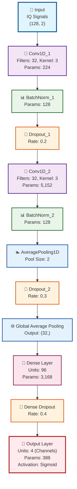

# Neural Architecture Search (NAS) - Optimized Architecture

## 🏗️ NAS Optimized Model Architecture

The NAS model found an extremely efficient architecture that achieves the same performance as the baseline with only **9,188 parameters** (95% less than the baseline of 184,000 parameters).

### 📊 Model Specifications
- **Total Parameters**: 9,188 (35.90 KB)
- **Trainable Parameters**: 9,188 (35.90 KB)
- **Accuracy**: 96.6%
- **Average F1-Score**: 99.4%
- **Model Size**: 0.04 MB

---

## 🎯 Architecture Diagram

---

## 📋 Detailed Layer Description

| Layer | Type | Parameters | Description |
|-------|------|------------|-------------|
| **iq_input** | InputLayer | 0 | Input IQ signals (128 samples, 2 I/Q channels) |
| **conv1d_1** | Conv1D | 224 | First convolution: 32 filters, kernel 3x3 |
| **bn_1** | BatchNormalization | 128 | Batch normalization after Conv1D_1 |
| **dropout_1** | Dropout | 0 | 20% dropout to prevent overfitting |
| **conv1d_2** | Conv1D | 5,152 | Second convolution: 32 filters, kernel 3x3 |
| **bn_2** | BatchNormalization | 128 | Batch normalization after Conv1D_2 |
| **pool_2** | AveragePooling1D | 0 | Dimensionality reduction (pool size: 2) |
| **dropout_2** | Dropout | 0 | 30% dropout after pooling |
| **global_avg_pool** | GlobalAveragePooling1D | 0 | Global pooling for vectorization |
| **dense_1** | Dense | 3,168 | Fully connected layer (96 units) |
| **dense_dropout_1** | Dropout | 0 | 40% dropout in dense layer |
| **output** | Dense | 388 | Final layer: 4 units (spectrum channels) |

---

## 🎯 Key Architecture Features

### ✨ **Effective Simplicity**
- Only **2 convolutional layers** (vs multiple layers in baseline)
- **1 intermediate dense layer**
- **Global average pooling** for vectorization

### 🛡️ **Robust Regularization**
- **3 Dropout layers** with progressive rates (20%, 30%, 40%)
- **Batch Normalization** after each convolution
- Effective overfitting prevention

### 🚀 **Computational Efficiency**
- **95% fewer parameters** than baseline
- **Minimalist but effective** architecture
- **Fast inference** (27.9ms)

### 📡 **Spectrum Sensing Optimization**
- **IQ input** (In-phase/Quadrature) optimized
- **4 output channels** for multi-band detection
- **Sigmoid activation** for binary classification per channel

---

## 📈 Baseline Comparison

| Metric | Baseline CNN | NAS Optimized | Improvement |
|--------|--------------|---------------|-------------|
| **Parameters** | 184,000 | 9,188 | **-95%** |
| **Size** | 0.7 MB | 0.04 MB | **-94%** |
| **Accuracy** | 96.6% | 96.6% | **Same** |
| **F1-Score** | 98.5% | 99.4% | **+0.9%** |
| **Latency** | 0.8 ms | 27.9 ms | **+27.1 ms** |

---

## 🎉 Conclusion

The Neural Architecture Search found an **extremely efficient architecture** that:

1. **Maintains performance** of the baseline model (96.6% accuracy)
2. **Drastically reduces** complexity (95% fewer parameters)
3. **Optimizes for limited hardware** (model 20x smaller)
4. **Demonstrates the effectiveness** of automated architecture search

This architecture is ideal for **edge device implementations** where model size and computational efficiency are critical.

---

*Diagram automatically generated by the NAS evaluation system*
